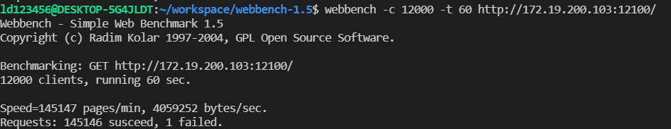
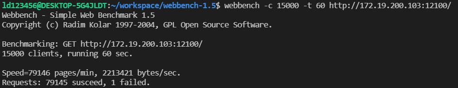

### 个人简单HTTP服务器

#### 项目结构

```
httpserver
├── CMakeLists.txt
├── README.md
├── bin
│   ├── main
│   └── make.sh
├── include
│   ├── header.h
│   ├── http.h
│   └── utils.h
├── resources
│   ├── file
│   ├── http
│   │   ├── 404.html
│   │   ├── 500.html
│   │   ├── 501.html
│   │   └── index.html
│   └── img
│       ├── epoll测试1.png
│       └── epoll测试2.png
├── src
│   ├── http.cpp
│   └── utils.cpp
└── main.cpp
```

|文件名|内容|
|:--|:--|
|CMakeLists.txt|编译配置|
|bin|编译生成的二进制可执行文件|
|resources|资源文件|
|include|头文件|
|src|源文件|
|http.cpp|返回状态码以及对应的html文件|
|utils.cpp|工具|
|mian.cpp|主函数|


##### 运行环境
```
WSL Ubuntu 20.04
g++ 9.3.0
cmake 3.16.3
make 4.2.1
```

#### 编译及运行
```shell
$ cd bin
$ sh make.sh
$ ./main 10000 # 设置运行端口号为10000,默认监听端口号12100
```


#### 1.1
增加了epoll多路复用，可以正常返回index.html
性能测试：




#### 1.0
功能：简单的服务器访问，目前仅能通过ip地址+端口号访问
访问解析有点问题，不能返回index.html

